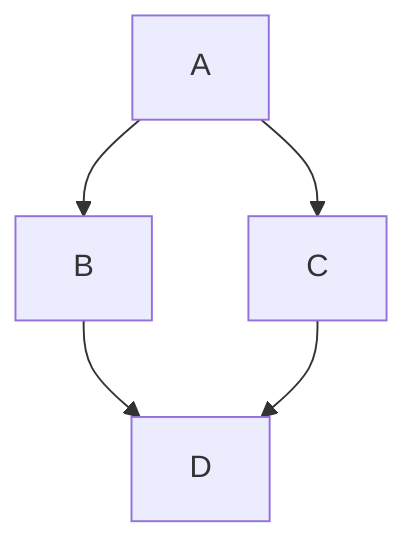
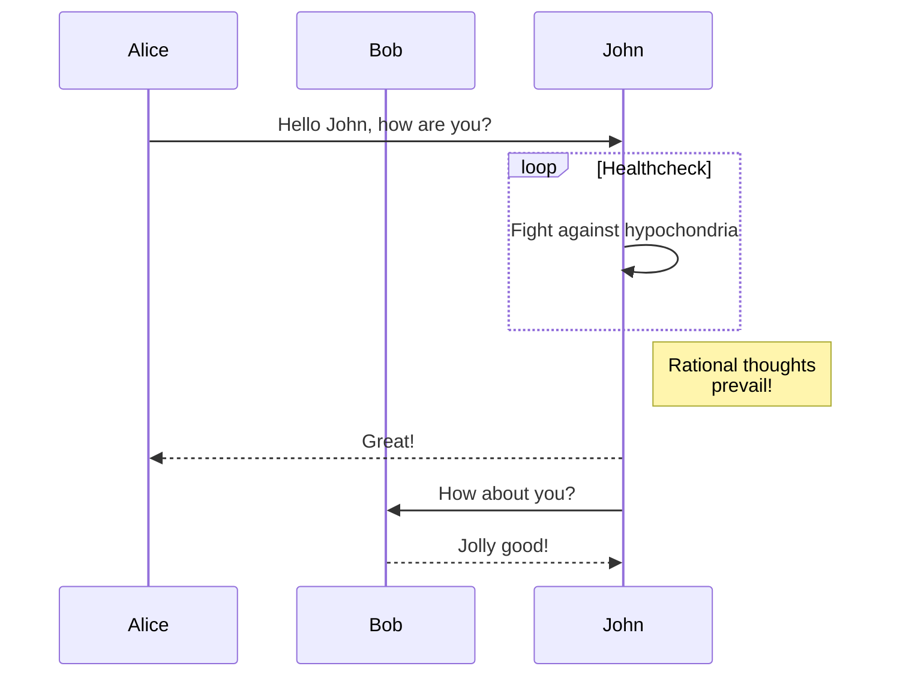
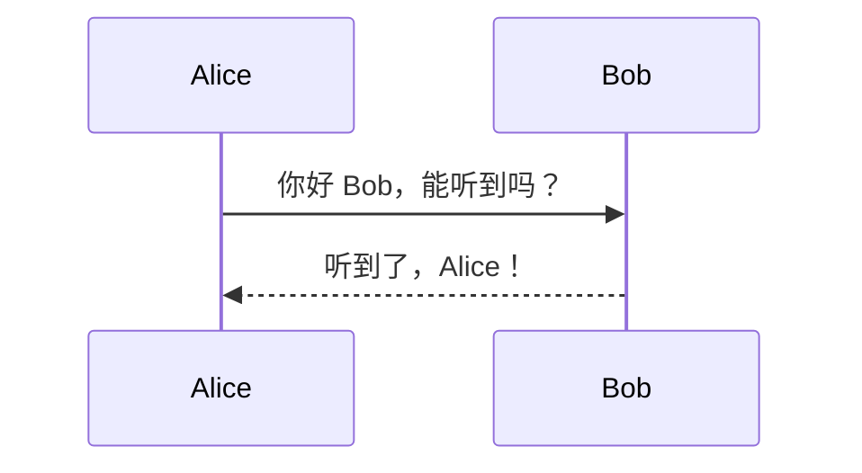
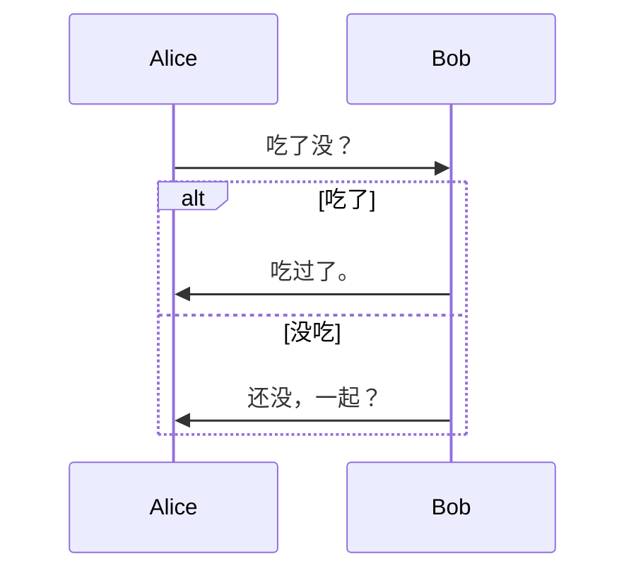
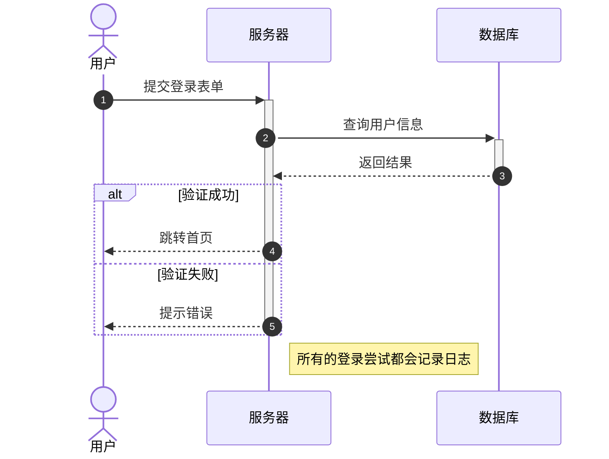
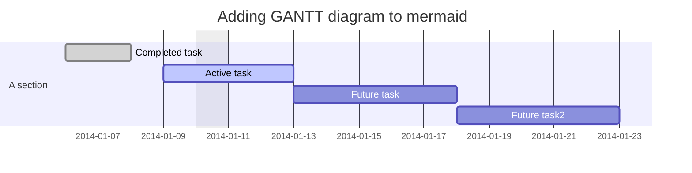
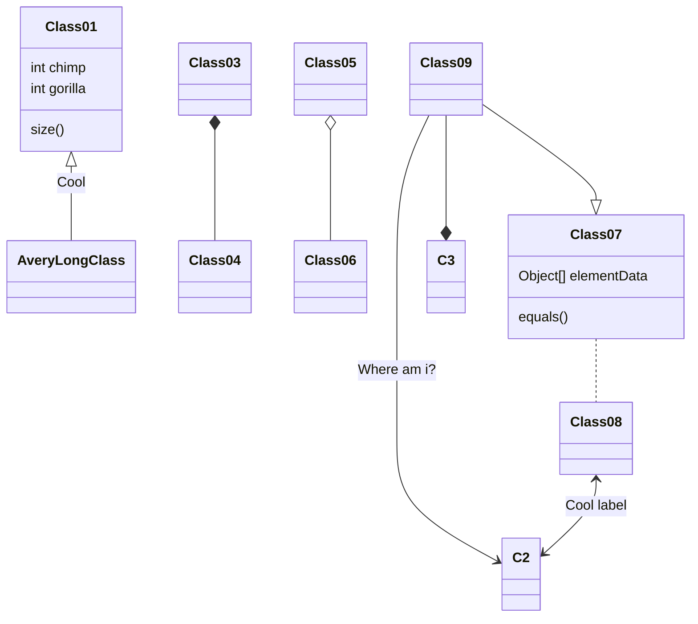
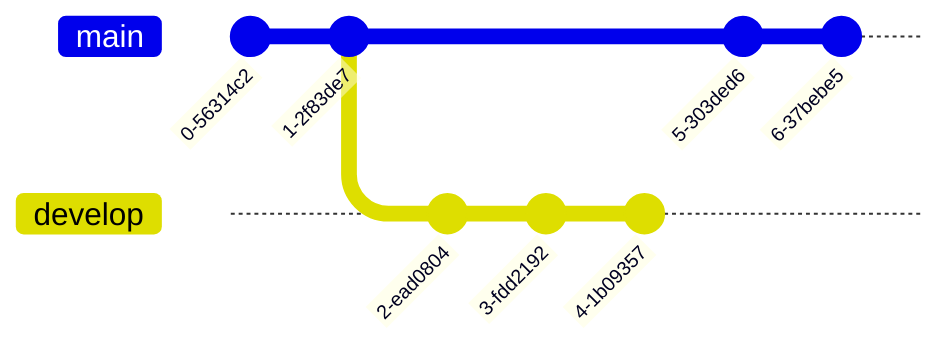
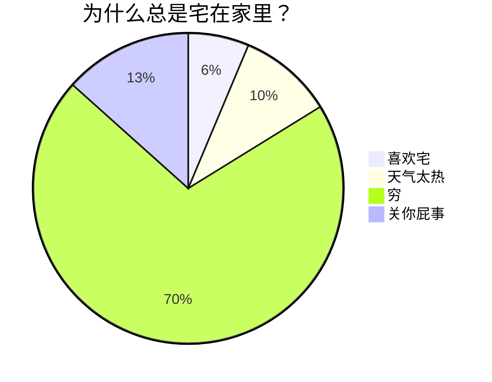
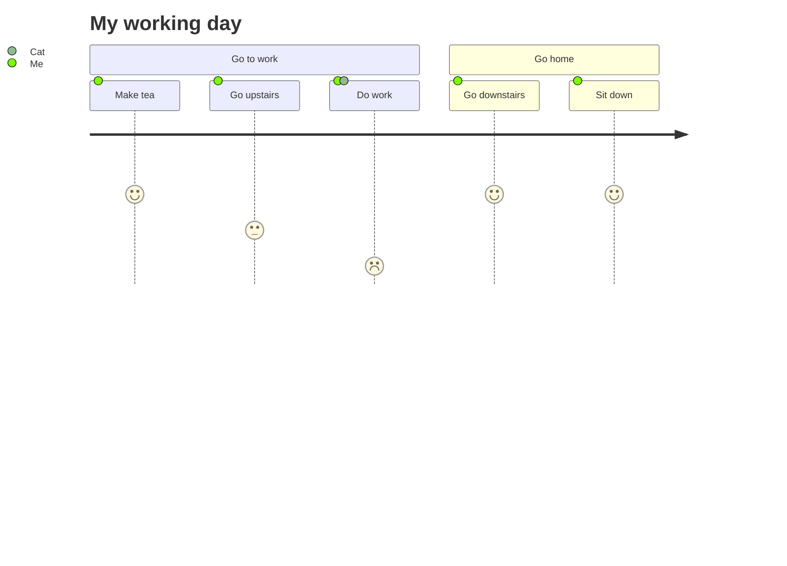

# 流程图

```text
graph TD;
    A-->B;
    A-->C;
    B-->D;
    C-->D;
```

```mermaid
graph TD;
    A-->B;
    A-->C;
    B-->D;
    C-->D;
```

# 时序图

```text
sequenceDiagram
    participant Alice
    participant Bob
    Alice->>John: Hello John, how are you?
    loop Healthcheck
        John->>John: Fight against hypochondria
    end
    Note right of John: Rational thoughts <br/>prevail!
    John-->>Alice: Great!
    John->>Bob: How about you?
    Bob-->>John: Jolly good!
```

```mermaid
sequenceDiagram
    participant Alice
    participant Bob
    Alice->>John: Hello John, how are you?
    loop Healthcheck
        John->>John: Fight against hypochondria
    end
    Note right of John: Rational thoughts <br/>prevail!
    John-->>Alice: Great!
    John->>Bob: How about you?
    Bob-->>John: Jolly good!
```


Mermaid 的 **Sequence Diagram（时序图/序列图）** 是开发中非常常用的工具，它通过简单的文本代码来描述对象之间如何随时间交互。

## 1. 基础结构

时序图必须以 `sequenceDiagram` 开头。



```mermaid
sequenceDiagram
    Alice->>Bob: 你好 Bob，能听到吗？
    Bob-->>Alice: 听到了，Alice！

```

## 2. 核心语法组件

### 参与者 (Participants)

默认情况下，参与者按照出现的顺序排列。你可以使用 `participant` 关键字手动定义顺序或起别名。

* **常规：** `participant A`
* **别名：** `participant A as Alice`
* **外观：** 使用 `actor` 可以将图标显示为小人。

### 消息类型 (Messages)

消息线的样式取决于连接符的写法：

| 符号 | 描述 |
| --- | --- |
| `->` | 无箭头的实线 |
| `->>` | 有实心箭头的实线（同步请求） |
| `-->>` | 有实心箭头的虚线（异步/返回响应） |
| `-x` | 带叉号的实线（表示消息丢失/异步） |

## 3. 进阶控制流程

### 激活与停用 (Activation)

表示一个对象在某个时间段内正处于处理状态。

* 使用 `activate 参与者` 和 `deactivate 参与者`。
* 或者简写：在消息符号后加 `+` 或 `-`（例如 `A->>+B: 请求`）。

### 逻辑分支 (Alt & Opt)

* **Alt (Alternative):** 类似 `if-else` 逻辑。
* **Opt (Optional):** 类似单个 `if` 逻辑。

```text
sequenceDiagram
    Alice->>Bob: 吃了没？
    alt 吃了
        Bob->>Alice: 吃过了。
    else 没吃
        Bob->>Alice: 还没，一起？
    end
```


```mermaid
sequenceDiagram
    Alice->>Bob: 吃了没？
    alt 吃了
        Bob->>Alice: 吃过了。
    else 没吃
        Bob->>Alice: 还没，一起？
    end

```

### 循环 (Loop)

表示重复执行的动作。

```text
loop 每天
    Alice->>Alice: 刷牙洗脸
end
```

## 4. 辅助功能

* **注释 (Notes):** 在侧边添加文字说明。
* `Note left of Alice: 思考中...`
* `Note over Alice, Bob: 两个人的对话`

* **并行 (Parallel):** 使用 `par` 块表示同时发生的动作。
* **背景突出 (Rect):** 使用 `rect rgb(0, 255, 0)` 为特定区域添加颜色背景。

---

```text
sequenceDiagram
    autonumber
    actor U as 用户
    participant S as 服务器
    participant D as 数据库

    U->>+S: 提交登录表单
    S->>+D: 查询用户信息
    D-->>-S: 返回结果
    
    alt 验证成功
        S-->>U: 跳转首页
    else 验证失败
        S-->>-U: 提示错误
    end

    Note right of S: 所有的登录尝试都会记录日志
```


```mermaid
sequenceDiagram
    autonumber
    actor U as 用户
    participant S as 服务器
    participant D as 数据库

    U->>+S: 提交登录表单
    S->>+D: 查询用户信息
    D-->>-S: 返回结果
    
    alt 验证成功
        S-->>U: 跳转首页
    else 验证失败
        S-->>-U: 提示错误
    end

    Note right of S: 所有的登录尝试都会记录日志
```

# 甘特图

```text
gantt
dateFormat  YYYY-MM-DD
title Adding GANTT diagram to mermaid
excludes weekdays 2014-01-10

section A section
Completed task            :done,    des1, 2014-01-06,2014-01-08
Active task               :active,  des2, 2014-01-09, 3d
Future task               :         des3, after des2, 5d
Future task2              :         des4, after des3, 5d
```

```mermaid
gantt
dateFormat  YYYY-MM-DD
title Adding GANTT diagram to mermaid
excludes weekdays 2014-01-10

section A section
Completed task            :done,    des1, 2014-01-06,2014-01-08
Active task               :active,  des2, 2014-01-09, 3d
Future task               :         des3, after des2, 5d
Future task2               :         des4, after des3, 5d
```

# 类图

```text
classDiagram
Class01 <|-- AveryLongClass : Cool
Class03 *-- Class04
Class05 o-- Class06
Class07 .. Class08
Class09 --> C2 : Where am i?
Class09 --* C3
Class09 --|> Class07
Class07 : equals()
Class07 : Object[] elementData
Class01 : size()
Class01 : int chimp
Class01 : int gorilla
Class08 <--> C2: Cool label
```

```mermaid
classDiagram
Class01 <|-- AveryLongClass : Cool
Class03 *-- Class04
Class05 o-- Class06
Class07 .. Class08
Class09 --> C2 : Where am i?
Class09 --* C3
Class09 --|> Class07
Class07 : equals()
Class07 : Object[] elementData
Class01 : size()
Class01 : int chimp
Class01 : int gorilla
Class08 <--> C2: Cool label
```
# Git历史图

```text
    gitGraph
       commit
       commit
       branch develop
       commit
       commit
       commit
       checkout main
       commit
       commit
```

```mermaid
    gitGraph
       commit
       commit
       branch develop
       commit
       commit
       commit
       checkout main
       commit
       commit
```

# 饼状图
```text
pie
    title 为什么总是宅在家里？
    "喜欢宅" : 45
    "天气太热" : 70
    "穷" : 500
    "关你屁事" : 95
```

```mermaid
pie
    title 为什么总是宅在家里？
    "喜欢宅" : 45
    "天气太热" : 70
    "穷" : 500
    "关你屁事" : 95
```


# 行程图

```text
journey
    title My working day
    section Go to work
      Make tea: 5: Me
      Go upstairs: 3: Me
      Do work: 1: Me, Cat
    section Go home
      Go downstairs: 5: Me
      Sit down: 5: Me
```

```mermaid
journey
    title My working day
    section Go to work
      Make tea: 5: Me
      Go upstairs: 3: Me
      Do work: 1: Me, Cat
    section Go home
      Go downstairs: 5: Me
      Sit down: 5: Me
```
