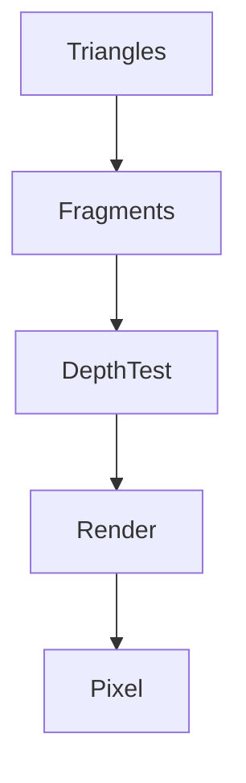

# 目的

普通的渲染流程（没有应用`Early-Z`）：

其中大部分的`Fragments`都会在`Depth Test`阶段failed，这一段会造成效率浪费；

如果**所有的`Fragments`都确保会通过`Depth Test`**，那么效率会提高很多，延迟渲染就是做了这样一件事；

# 做法

将场景光栅化两次；

Pass1：不着色，只更新`Depth Buffer`，将结果存入`G-Buffer`；
Pass2：遍历每个顶点，只有深度小等于`Depth Buffer`的才会送去着色；

# 改进

## 分块渲染 Tiled Shading

`Tiled Shading`，也被称为`Tile-Based Deferred Shading`，是一种在计算机图形学中用于提高渲染效率的技术；这种技术的主要思想是将屏幕空间划分为多个小块，然后对每个小块进行独立的光照计算；

在传统的延迟渲染中，每个像素都需要与场景中的所有光源进行交互，这在光源数量较多的情况下会导致效率低下‘；

而在`Tiled Shading`中，**每个`tile`只需要与影响到该`tile`的光源进行交互**，从而大大减少了光源处理的数量，提高了渲染效率；

## 聚类渲染 Clustered Shading

`Clustered Shading`，是一种在计算机图形学中用于提高渲染效率的技术；它是`Tiled Shading`的一种扩展，不仅在二维屏幕空间上进行划分，还在深度方向上进行划分，形成了一个三维的聚类空间；

因为考虑了深度信息，所以可以更好地处理大范围和小范围的光源；同时，由于每个聚类只处理影响到它的光源，所以可以大大减少光源处理的数量，提高渲染效率；

